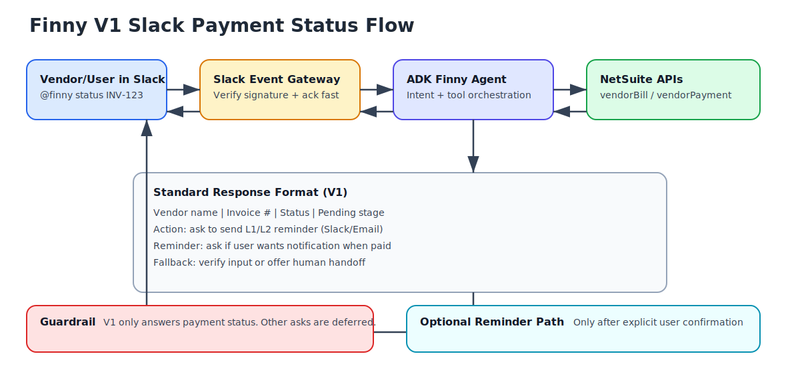

# Sharechat x Finny Agent Proposal

## 1) Executive Summary

We propose a phased delivery for Sharechat's P2P finance assistant in Slack.
We will deliver **V1 first** in 15 working days:

- A Slack agent (`@finny`) that answers vendor payment status from NetSuite.
- Structured response format for finance operations.
- Optional reminder workflow for pending approvals.

V2 and V3 are included as roadmap scope, not part of V1 delivery.

## 2) Scope of Work

## V1 (delivery in this engagement)

- Slack interaction: `@finny` mention and direct message (both live from day one).
- Payment status lookup by invoice number or vendor name.
- Pending stage and recommended next action.
- Confirmation-based reminder trigger (Slack/email) for pending approvals.
- Not-found handling with verification and human handoff option.
- Basic audit logging and operational runbook.

## V2 (next phase)

- Reimbursement status support.
- Vendor + reimbursement combined status responses.
- Access controls by role/team.

## V3 (next phase)

- Monthly trends and analytics for vendor payments.
- Reporting views by access rights and stakeholder role.
- Proactive insights and SLA/aging intelligence.

## 3) What V1 Includes and Excludes

### Included

- Production-ready Slack app integration.
- NetSuite payment-status connector.
- Deterministic response template.
- UAT support and documentation.

### Excluded from V1

- New dashboards and BI reports.
- End-to-end reimbursement workflows.
- Vendor onboarding/KYC automation.
- Multi-system orchestration beyond NetSuite + Slack.

## 4) User Experience (V1)

### Sample interaction

User:
`@finny what is the status of INV-2024-001`

Finny:

```text
Vendor name: Google Cloud India Pvt Ltd
Invoice #: INV-2024-001
Status: Pending Approval
Pending stage: L2 (Finance)
Action: Would you like me to send a reminder to the L2 approver now?
Reminder: I can also notify you when this invoice is marked Paid.
Fallback: If this invoice looks incorrect, share vendor name or I can connect a human agent.
```

### Flow visual



## 5) Timeline (15 Working Days)

## Week 1 (Day 1-5)

- Finalize V1 acceptance criteria.
- Set up Slack app, events, scopes, and security.
- Wire `app_mention` and direct-message handling so both delivery paths work.
- Set up ADK service skeleton and response formatting.
- Validate NetSuite sandbox auth and record access.

## Week 2 (Day 6-10)

- Implement payment-status lookup APIs in agent tools.
- Implement mention/DM handling and threaded replies.
- Add reminder-confirmation workflow.
- Build error handling and not-found/handoff paths.

## Week 3 (Day 11-15)

- Full testing (unit + integration + UAT scenarios).
- Performance/security hardening.
- UAT with finance team and bug fixes.
- Handover, runbook, and go-live checklist.

## 6) Required Inputs from Sharechat

## Slack requirements

- Workspace admin sponsor for app approval.
- App credentials:
  - Client ID
  - Client Secret
  - Signing Secret
  - Bot token (`xoxb-...`)
- Approved scopes:
  - `app_mentions:read`
  - `chat:write`
  - `channels:read` (or restricted channel strategy)
- Event subscription request URL access (public HTTPS endpoint).

## NetSuite requirements

- Sandbox account details and account-specific domain.
- Integration setup enabled for REST APIs.
- OAuth 2.0 secured connection (client ID/secret, redirect URI, authorized role).
- Role with permissions to read:
  - Vendor
  - Vendor Bill
  - Vendor Payment
- Sample invoice/vendor IDs for UAT test cases.

## Business requirements

- Final response template approval.
- List of approver mappings for L1/L2 reminder use case.
- Escalation rules for human handoff.

## 7) Commercials (V1)

### Estimated cost

- **Rs 60,000 + applicable taxes** (covers V1 delivery plus the scoped V2 items described above).
- Includes **three months of free maintenance** (monitoring, incident response, configuration tweaks; no new feature development in that window).

### Assumptions included in this estimate

- 15 working days with timely credential/access support.
- One Slack workspace and one NetSuite sandbox scope.
- Up to 2 structured UAT cycles.
- No new external paid SaaS procurement in V1.

### Not included in estimate

- NetSuite production rollout support beyond the agreed hypercare window.
- Additional features outside V1/V2 scope.
- New development during the three-month maintenance window.

## 8) Acceptance Criteria for V1 Sign-off

- `@finny` returns payment status for invoice/vendor in agreed format.
- Not-found and ambiguous queries are handled safely.
- Reminder intent works with explicit user confirmation.
- UAT test pack executed successfully.
- Runbook and operational handover completed.

## 9) Next Steps

1. Confirm approval of V1 scope and commercials.
2. Share Slack and NetSuite sandbox credentials/access.
3. Approve implementation start date.
4. Nominate business and technical SPOCs for daily validation.

## 10) Open Clarifications

- Any compliance constraints for storing Slack query metadata?

## 11) API References Used

- Slack AI apps:
  https://docs.slack.dev/ai/developing-ai-apps
- Slack app setup:
  https://docs.slack.dev/app-management/quickstart-app-settings/
- Slack OAuth:
  https://docs.slack.dev/authentication/installing-with-oauth/
- Slack request signing:
  https://docs.slack.dev/authentication/verifying-requests-from-slack/
- Slack messaging API:
  https://docs.slack.dev/reference/methods/chat.postMessage/
- NetSuite auth:
  https://docs.oracle.com/en/cloud/saas/netsuite/ns-online-help/article_0627022005.html
- NetSuite vendor:
  https://docs.oracle.com/en/cloud/saas/netsuite/ns-online-help/article_164337045826.html
- NetSuite vendor bill:
  https://docs.oracle.com/en/cloud/saas/netsuite/ns-online-help/article_164484956387.html
- NetSuite vendor payment:
  https://docs.oracle.com/en/cloud/saas/netsuite/ns-online-help/article_7095737506.html
